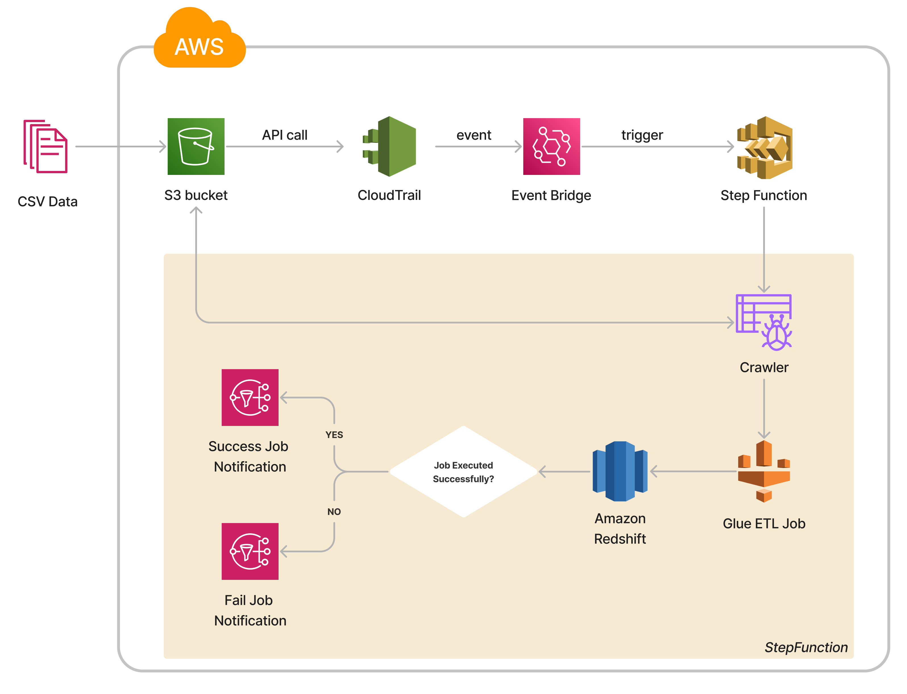

# AWS-Airline-Data-Batch-Processing

## Overview

This project establishes a batch processing pipeline for airline data on AWS. Upon data arrival in the S3 bucket, events are triggered through CloudTrail and EventBridge. It triggers the Step Function which automates the ETL operations that are executed using AWS Glue. The end goal is to load the processed data into Amazon Redshift, with notifications for both successful and failed ETL jobs.

## Architecture

The pipeline structure is as follows:

1. **Airline Data Loading to S3:**
- Airline data is loaded into S3 bucket by the producer.

2. **Event Trigger with CloudTrail and EventBridge:**
- CloudTrail monitors S3 bucket events and triggers EventBridge upon data upload.

3. **Automation with Step Function:**
- EventBridge triggers Step Function, which executes the processing workflow.

4. **Glue Crawler and PySpark ETL Job:**
- Step Function initiates Glue Crawler to identify the schema of the arrived data.
- Once the crawler completes its task, it triggers Glue PySpark ETL job.
- If the job was successful, the processed data is loaded into Amazon Redshift.
- Notifications are sent for both successful and failed ETL jobs.

### Prerequisites
- AWS account with appropriate IAM permissions to the above services.
- Redshift VPC Connection.
